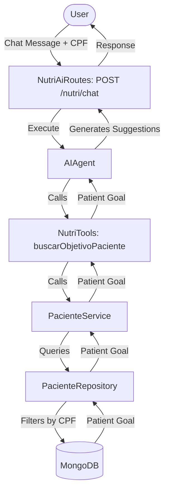

# Requirements

### Overview & Goals
The objective is to implement a new AI-powered nutrition assistant feature using the **Koog** library. This assistant will allow users to provide a patient's CPF via chat, retrieve their nutritional goals from MongoDB, and receive personalized food suggestions generated by an LLM.

### Scope
- **In Scope:**
    - Modification of `PacienteRepository`, `PacienteMongoRepository`, and `PacienteService` to support CPF-based lookups.
    - Implementation of `NutriTools` as a Koog-compatible tool.
    - Creation of a new Ktor route `POST /nutri/chat`.
    - Integration and registration of the new components (Koin, Routing).
- **Out of Scope:**
    - Frontend/UI development.
    - Complex custom nutritional logic (relying on LLM intelligence).

# Technical Design

### Current Implementation
- **Data Layer:** `Paciente` data is stored in MongoDB, but existing methods only support lookup by `id` or `nome`.
- **AI Layer:** The project already includes the `Koog` library and has some example AI routes in `src/features/test/ai/`.
- **DI/Routing:** Uses Koin for dependency injection and a centralized `Routing.kt` for Ktor routes.

### Key Decisions
- **Tooling:** Use Koog's `@Tool` annotation to expose patient data to the AI Agent. This allows the Agent to decide when to call the search function based on the user's input.
- **Agent Strategy:** Use the `reActStrategy` from Koog to allow the agent to reason and use tools.
- **Prompting:** Use a system prompt that instructs the agent to ask for a CPF if not provided and to use the tool to fetch goals before suggesting foods.

### Proposed Changes
#### 1. Data Layer (`ai.features.paciente`)
- Update `PacienteRepository.kt`:
    - Add `suspend fun findByCpf(cpf: String): Paciente?`
    - Implement it in `PacienteMongoRepository` using `Filters.eq("cpf", cpf)`.

#### 2. Service Layer (`ai.features.paciente`)
- Update `PacienteService.kt`:
    - Add `suspend fun findByCpf(cpf: String): Paciente?`.

#### 3. AI Layer (`ai.features.nutriai`)
- New class `NutriTools`:
    - Method `buscarObjetivoPaciente(cpf: String)`: Finds the patient and returns their objective.
- New file `NutriAiRoutes.kt`:
    - Defines `POST /nutri/chat`.
    - Sets up `AIAgent` with `NutriTools`.

#### 4. Infrastructure & DI
- Create `NutriAiModule.kt` in `src/di` to register `NutriTools`.
- Register the new module in `src/plugins/Koin.kt`.
- Register the new route in `src/plugins/Routing.kt`.

### File Structure
- `src/features/paciente/` (Modified)
- `src/features/nutriai/` (New)
    - `NutriTools.kt`
    - `NutriAiRoutes.kt`
- `src/di/NutriAiModule.kt` (New)

### Architecture Diagram

# Testing

### Validation Approach
Verification will involve both unit tests for the new data access method and integration tests for the AI endpoint.

### Key Scenarios
1. **Successful Personalized Suggestion:**
    - **Input:** "Meu CPF é 12345678901, o que devo comer para o meu objetivo?"
    - **Expected:** The agent identifies the CPF, calls the tool, finds the goal (e.g., "Ganho de massa"), and suggests appropriate foods (e.g., proteins, complex carbs).
2. **Missing CPF Prompt:**
    - **Input:** "O que devo comer hoje?"
    - **Expected:** The agent recognizes the lack of context and asks for the user's CPF.
3. **Patient Not Found:**
    - **Input:** "Meu CPF é 00000000000, o que devo comer?"
    - **Expected:** The agent informs the user that no patient was found for that CPF.

### Test Changes
- **New Unit Test:** `PacienteCpfTest.kt` to verify `findByCpf` logic.
- **New Integration Test:** `NutriAiTest.kt` using `testApplication` to verify the `/nutri/chat` endpoint.

# Delivery Steps

### ✓ Step 1: Extend Paciente Repository and Service with CPF lookup
Extend the patient data layer to support searching by CPF.

- Add `findByCpf(cpf: String): Paciente?` to the `PacienteRepository` interface in `src/features/paciente/PacienteRepository.kt`.
- Implement `findByCpf` in `PacienteMongoRepository` using `Filters.eq("cpf", cpf)`.
- Add `findByCpf` method to `PacienteService` in `src/features/paciente/PacienteService.kt`.
- Add a unit test in `test/PacienteTest.kt` (or a new file) to verify CPF lookup.

### ✓ Step 2: Implement NutriTools with Koog annotations
Create a Koog Tool that retrieves patient objectives.

- Create a new package `ai.features.nutriai` and file `src/features/nutriai/NutriTools.kt`.
- Implement `NutriTools` class with a `buscarObjetivoPaciente` method.
- Annotate the method with `@Tool` and `@LLMDescription` to make it discoverable by the AI Agent.
- Wire the tool to use `PacienteService` for data retrieval.

### ✓ Step 3: Create NutriAi routes and register dependencies
Expose the AI assistant via a new Ktor endpoint and register all dependencies.

- Create `src/features/nutriai/NutriAiRoutes.kt` with a `POST /nutri/chat` endpoint.
- Configure `AIAgent` with `NutriTools`, a system prompt, and the `reActStrategy`.
- Register the new routes in `src/plugins/Routing.kt`.
- Create `src/di/NutriAiModule.kt` to register `NutriTools` and add it to `src/plugins/Koin.kt`.
- Add an integration test in `test/NutriAiTest.kt` to verify the chat flow.