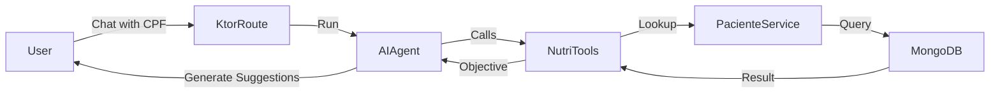

# Requirements

### Overview & Goals
The goal is to implement a new feature that uses the **Koog** library to create an AI-powered nutrition assistant. This assistant will be able to retrieve a patient's objective by their CPF and suggest the best foods to achieve that goal.

### Scope
- **In Scope:**
  - Extending the `Paciente` data access layer to support CPF lookups.
  - Creating a Koog Tool to bridge patient data with the AI Agent.
  - Adding a new API endpoint for chat-based interactions.
- **Out of Scope:**
  - UI implementation.
  - Complex nutritional calculations (suggestions will be LLM-generated).

# Technical Design

### Current Implementation
The project already uses **Koog** for AI features (see `AiNutriRoutes.kt` and `ServiceAi.kt`) and has a feature-based structure. `Paciente` data is stored in MongoDB but is currently only accessible by `id` or `nome`.

### Key Decisions
- **Tool Logic:** The tool will return the patient's objective and a prompt, allowing the Agent (LLM) to generate personalized food suggestions.
- **Patient Lookup:** The CPF will be extracted from the user's chat message by the Agent.

### Proposed Changes
- **Data Layer:**
  - `PacienteRepository`: New `findByCpf` method.
  - `PacienteMongoRepository`: MongoDB implementation for `findByCpf`.
- **Logic Layer:**
  - `NutriTools`: A new class with the `@Tool` method `buscarObjetivoPaciente`.
- **API Layer:**
  - `NutriAiRoutes`: New Ktor routing file.
  - `Routing.kt`: Integration of the new routes.

### File Structure
- `src/features/paciente/` (Modified)
- `src/features/nutriai/` (New)
  - `NutriTools.kt`
  - `NutriAiRoutes.kt`

### Architecture Diagram

# Testing

### Validation Approach
Verification will be done by calling the new `/nutri/chat` endpoint with messages containing test CPFs.

### Key Scenarios
1. **Successful Lookup:**
   - Input: "Meu CPF é 123.456.789-00, o que devo comer?"
   - Expected: Agent finds the patient, mentions their objective (e.g., "Emagrecimento"), and lists appropriate foods.
2. **Patient Not Found:**
   - Input: "Meu CPF é 000.000.000-00, me dê sugestões."
   - Expected: Agent informs that the patient was not found.
3. **Missing CPF:**
   - Input: "O que devo comer?"
   - Expected: Agent asks for the CPF to provide personalized advice.

# Delivery Steps

###   Step 1: Extend Paciente Repository and Service with CPF lookup
Enable searching for patients by their CPF in the database.

- Add `findByCpf(cpf: String): Paciente?` to the `PacienteRepository` interface.
- Implement `findByCpf` in `PacienteMongoRepository` using MongoDB filters.
- Add `findByCpf` method to `PacienteService` to expose this functionality.

###   Step 2: Implement NutriTools with Koog annotations
Create a Koog-compatible tool that retrieves patient goals and suggests foods.

- Create `NutriTools.kt` in a new `ai.features.nutriai` package.
- Implement a function annotated with `@Tool` and `@LLMDescription` that:
    - Accepts a `cpf` string.
    - Uses `PacienteService` to find the patient.
    - Returns the patient's objective and a prompt for food suggestions.

###   Step 3: Create NutriAi routes and register dependencies
Expose the new AI feature via a Ktor route.

- Create `NutriAiRoutes.kt` to define the `POST /nutri/chat` endpoint.
- Configure an `AIAgent` with `NutriTools` and a system prompt guiding its behavior.
- Register the new routes in `src/plugins/Routing.kt`.
- Register `NutriTools` in Koin (either in a new module or updating `PacienteModule`).
