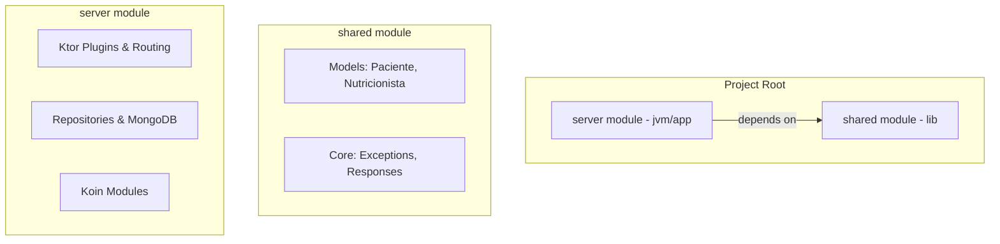

# Requirements

### Overview & Goals
The goal is to migrate the current monolithic Amper project to the **New Default Project Structure for Kotlin Multiplatform**. This involves splitting the project into a multi-module setup to facilitate code sharing and follow industry best practices.

### Scope
- **In Scope**:
  - Reorganizing the project into `server` and `shared` modules.
  - Moving models and core logic to the `shared` module.
  - Moving Ktor-specific logic to the `server` module.
  - Updating Amper configurations (`module.yaml`).
- **Out of Scope**:
  - Implementing a frontend (`composeApp`).
  - Significant logic refactoring (except for module separation).
  - Changing the database (MongoDB).


# Technical Design

### Current Implementation
The project is currently a single-module Amper project (`product: jvm/app`) with all code residing in a top-level `src` directory. It uses Ktor for the backend and MongoDB for data storage.

### Proposed Changes
We will adopt a multi-module architecture using Amper's modularity features.

#### Project Layout (Tree View)
```text
expert/
├── server/                 # Ktor Server Application
│   ├── module.yaml         # product: jvm/app, depends on: [shared]
│   └── src/
│       ├── main.kt
│       ├── features/       # Route implementations and Repositories
│       ├── plugins/        # Ktor configuration
│       ├── di/             # Koin modules for server
│       └── infrastructure/ # MongoDB factory
├── shared/                 # Shared Code (Common)
│   ├── module.yaml         # product: lib, targets: [jvm, (ios/android placeholders)]
│   └── src/
│       ├── models/         # Nutricionista, Paciente, etc.
│       └── core/           # AppException, ErrorResponse
├── libs.versions.toml      # Shared version catalog
└── module.yaml             # (Optional) Root project settings
```

#### Key Decisions
- **Module Separation**: We split the project into `shared` and `server`. This is the standard KMP pattern.
- **Dependency Management**: `server` will have a project dependency on `shared`.
- **Amper Product Types**: `shared` will be a `lib`, while `server` remains a `jvm/app`.

#### Architecture Diagram


### File Migration Map
 Original Path | New Path | Module |
 :--- | :--- | :--- |
 `src/features/nutricionista/Nutricionista.kt` | `shared/src/features/nutricionista/Nutricionista.kt` | `shared` |
 `src/features/paciente/Paciente.kt` | `shared/src/features/paciente/Paciente.kt` | `shared` |
 `src/core/exceptions/*` | `shared/src/core/exceptions/*` | `shared` |
 `src/main.kt` | `server/src/main.kt` | `server` |
 `src/plugins/*` | `server/src/plugins/*` | `server` |
 `src/features/*/Routes.kt` | `server/src/features/*/Routes.kt` | `server` |
 `src/features/*/Repository.kt` | `server/src/features/*/Repository.kt` | `server` |


# Delivery Steps

###   Step 1: Initialize multi-module directory structure
Prepare the base directory structure for the new modules.
- Create `server` and `shared` directories.
- Create initial `module.yaml` for both.
- Move `libs.versions.toml` to the root (it's already there).


###   Step 2: Migrate common code to the shared module
Move platform-agnostic code to the `shared` module.
- Move models (`Nutricionista.kt`, `Paciente.kt`, etc.) to `shared/src`.
- Move base exceptions (`AppException.kt`) to `shared/src`.
- Update package names if necessary to align with the new structure.
- Adjust `shared/module.yaml` to include necessary dependencies like `kotlinx-serialization`.


###   Step 3: Migrate backend code to the server module
Move the Ktor application code to the `server` module.
- Move `main.kt`, `plugins/`, `di/`, `infrastructure/` and feature implementations (Repositories/Routes/Services) to `server/src`.
- Update `server/module.yaml` to depend on the `shared` module.
- Ensure all Ktor and MongoDB dependencies are correctly scoped to the `server` module.


###   Step 4: Cleanup and verification
Finalize the transition by cleaning up the root and ensuring the project builds.
- Remove the old `src` and `test` directories from the root.
- Update `test/` to `server/test` if applicable.
- Verify that imports are correct across both modules.
